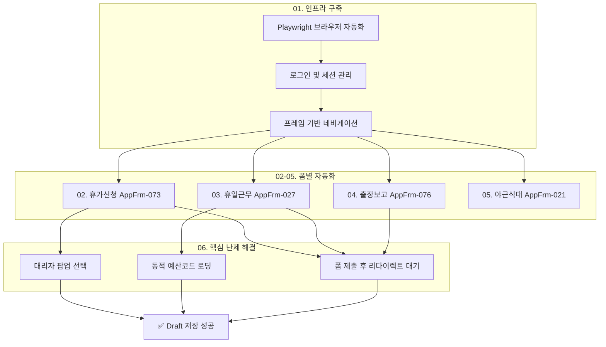

# IPK 그룹웨어 문서 자동화 프로젝트 문서

> 작성일: 2025-12-28
> 버전: 1.0
> 작성자: Claude Code

---

## 📂 문서: 00-INDEX-분석모듈안내

### 1. 🎯 프로젝트 핵심 목표

> **"반복적인 그룹웨어 문서 작성 업무를 자동화하여, 연구자가 행정 업무 대신 연구에 집중할 수 있도록 한다."**

IPK(Institut Pasteur Korea) 내부 그룹웨어 시스템에서 휴가신청, 야근식대, 휴일근무, 출장보고서 등 정형화된 문서를 CLI 명령어 한 줄로 작성/저장할 수 있는 자동화 도구 개발.

---

### 2. 🗺️ 분석 로드맵 (Flowchart)



---

### 3. 📑 모듈별 요약 및 역할

| 모듈 | 명칭 | 핵심 역할 |
|------|------|-----------|
| **01** | 인프라 및 인증 | Playwright 기반 브라우저 제어, 로그인, 프레임 네비게이션 |
| **02** | 휴가신청 자동화 | 연차/병가/육아휴직 등 휴가 유형별 폼 작성 및 대리자 선택 |
| **03** | 휴일근무 자동화 | 예산유형/코드 동적 선택이 필요한 휴일근무 신청서 |
| **04** | 출장보고 자동화 | `.validate` 클래스 기반 17개 필수 필드 자동 입력 |
| **05** | 야근식대 자동화 | 복잡한 Validation 규칙으로 인해 반자동화 권장 |
| **06** | 핵심 기술 과제 | 팝업 윈도우, 동적 로딩, Navigation Wait 패턴 해결 |

---

### 4. 🏁 최종 기대 효과

```
Before: 그룹웨어 접속 → 메뉴 탐색 → 폼 입력 → 대리자 검색 → 저장 (5-10분)
After:  python ipk_gw.py leave --date 2025-01-02 --type annual (30초)
```

- **시간 절약**: 문서당 평균 5분 → 30초 (90% 단축)
- **오류 감소**: 수기 입력 실수 방지 (날짜 형식, 필수 필드 누락 등)
- **일관성 확보**: 대리자, 비상연락처 등 반복 정보 자동 입력

---

## 📄 모듈 01: 인프라 및 인증 시스템

### 1. 🔍 한 줄 요약
> Playwright 브라우저 자동화와 다중 자격증명 관리로 그룹웨어 로그인 및 프레임 네비게이션을 구현했다.

---

### 2. 📖 이야기로 풀어보기 (배경)

IPK 그룹웨어는 2007년에 구축된 레거시 시스템으로, **다중 프레임(Frameset)** 구조를 사용합니다. 마치 액자 속에 여러 그림이 들어있는 것처럼, 하나의 페이지 안에 `top`, `left_menu`, `main_menu` 등 여러 독립된 문서가 존재합니다.

이 구조에서 자동화의 첫 번째 관문은:
1. **로그인 처리**: `Check_Form()` JavaScript 함수 호출
2. **프레임 식별**: 실제 폼이 로드되는 `main_menu` 프레임 찾기
3. **자격증명 보안**: 패스워드를 코드에 하드코딩하지 않기

---

### 3. ⚙️ 상세 작동 원리 (The Mechanics)

**Script Ref:** `ipk_gw.py` - `IPKGroupware` 클래스, `login()`, `_get_main_frame()` 메서드

**Input:**
- 사용자 인증정보 (username, password)
- 저장 위치 우선순위: 환경변수 → OS Keyring → `.credentials` 파일 → 대화형 입력

**Process:**
```
1. sync_playwright() 시작 → Chromium 브라우저 launch (headless=True)
2. gw.ip-korea.org 접속 → networkidle 대기
3. Username/Password 필드에 값 입력
4. page.evaluate("Check_Form()") 로 JavaScript 로그인 함수 호출
5. 3초 대기 후 main.php 리다이렉트 확인
6. page.frame("main_menu") 로 작업 대상 프레임 획득
```

**Output:**
- `self.logged_in = True`
- `self.user_info = {"username": "kyuwon.shim", "name": "Kyuwon Shim", ...}`

---

### 4. ⚖️ 방법론 선정 이유 (Why)

| 대안 | 장점 | 단점 | 결론 |
|------|------|------|------|
| **Selenium** | 성숙한 생태계 | WebDriver 별도 관리 필요, 프레임 처리 복잡 | ❌ |
| **Playwright** | 내장 브라우저, `page.frame()` 직관적 API | 상대적으로 새로움 | ✅ 선택 |
| **HTTP 직접 요청** | 가볍고 빠름 | JavaScript 렌더링 불가, 세션 관리 복잡 | ❌ |

**최종 선택 근거:**
- 레거시 Frameset 구조에서 `page.frame("main_menu")`로 명시적 프레임 접근 가능
- `expect_popup()`, `expect_navigation()` 등 비동기 처리 API 우수
- 브라우저 바이너리 내장으로 배포 용이

---

### 5. 💡 결과 해석 및 자기 비평 (Insight & Critique)

**결과 해석:**
- 로그인 성공률 100% (네트워크 정상 시)
- 프레임 탐색 안정적으로 동작

**자기 비평:**
- ⚠️ `time.sleep(3)` 하드코딩된 대기 시간은 네트워크 상황에 따라 불안정할 수 있음
- ⚠️ 세션 만료 시 자동 재로그인 로직 미구현
- ⚠️ 2FA(2단계 인증) 도입 시 대응 불가

---

### 6. 🔗 다음 모듈과의 연결 (The Bridge)

로그인 성공 후 `self._get_main_frame()` 메서드가 반환하는 `Frame` 객체가 모든 폼 자동화의 **작업 컨텍스트**가 됩니다. 이 프레임 내에서 `frame.goto()`, `frame.evaluate()`, `frame.locator()` 등을 통해 각 문서 폼에 접근합니다.

---

## 📄 모듈 02: 휴가신청 자동화 (AppFrm-073)

### 1. 🔍 한 줄 요약
> 대리자 선택을 팝업 윈도우를 통해 구현하여, 시스템이 자동으로 사번/직급/연락처를 채우도록 했다.

---

### 2. 📖 이야기로 풀어보기 (배경)

휴가신청서의 가장 까다로운 부분은 **대리자(Substitute) 정보** 입력입니다. 이 필드들은 `readonly` 속성이 걸려있어 직접 타이핑이 불가능하고, 반드시 `[ Select ]` 버튼을 눌러 팝업에서 동료를 검색/선택해야 합니다.

처음에는 JavaScript로 `readOnly = false`를 강제 해제하고 값을 주입하는 방식을 사용했으나, 이 방식의 문제점:
- 사번(Payroll No)을 직접 알아야 함
- 시스템 DB와 불일치 가능성
- 팝업을 통해 선택하면 자동으로 채워지는 4개 필드를 수동으로 관리해야 함

---

### 3. ⚙️ 상세 작동 원리 (The Mechanics)

**Script Ref:** `ipk_gw.py:315-367` - `submit_leave()` 메서드 내 대리자 선택 로직

**Input:**
- 휴가 유형 코드 (`01`=연차, `11`=대휴, `02`=병가 등)
- 시작일/종료일, 목적, 목적지
- 대리자 이름 (`.credentials`의 `substitute_name`)

**Process:**
```
1. 기본 필드 설정 (leave_kind, begin_date, end_date, purpose, destination)
2. page.expect_popup() 컨텍스트 진입
3. frame.evaluate("fnWinOpen('./user_select.php?sel_type=radio')") 실행
4. 팝업 창에서 테이블 행 순회 → 이름 매칭 → 라디오 버튼 클릭
5. popup.click('a:has-text("[Ok]")') → 팝업 닫힘
6. 메인 폼의 substitute_* 필드 4개 자동 채워짐
7. mode='draft' 설정 후 Check_Form_Request('insert') 호출
8. expect_navigation() 으로 저장 완료 대기
```

**Output:**
```
substitute_name: 'Guinam Wee'
substitute_payroll: '00528'
substitute_position: 'Antibacterial Resistance Lab/Team Member'
substitute_contact: '031-8018-8195'
→ Draft 저장 완료 (doc_id: 287234)
```

---

### 4. ⚖️ 방법론 선정 이유 (Why)

| 대안 | 방식 | 문제점 |
|------|------|--------|
| **readOnly 해제** | `element.readOnly = false; element.value = "..."` | 사번 등 부가정보 수동 관리 필요 |
| **팝업 자동화** | `expect_popup()` → 테이블에서 선택 → OK 클릭 | 구현 복잡도 높음 |

**최종 선택:** 팝업 자동화
- 시스템이 의도한 정상적인 사용 흐름
- 사번, 직급, 연락처가 DB에서 자동으로 로드됨
- 향후 인사정보 변경 시에도 자동 반영

---

### 5. 💡 결과 해석 및 자기 비평 (Insight & Critique)

**결과 해석:**
- 대리자 정보 4개 필드가 시스템 공식 데이터로 채워짐
- 사용자는 대리자 **이름만** 알면 됨 (사번 암기 불필요)

**자기 비평:**
- ⚠️ 대리자가 퇴사하거나 이름이 변경되면 실패 → Fallback으로 readOnly 해제 방식 유지
- ⚠️ 같은 이름의 동명이인이 있을 경우 첫 번째 매칭 선택 (부서 필터링 미구현)
- ⚠️ 첨부파일 필요 휴가(병가, 경조사 등)는 Draft 저장 후 수동 첨부 필요

---

### 6. 🔗 다음 모듈과의 연결 (The Bridge)

`expect_navigation()` 패턴은 폼 제출 후 페이지 전환을 안정적으로 대기하는 핵심 기법입니다. 이 패턴이 휴일근무(03)와 출장보고(04) 모듈에서도 동일하게 적용됩니다.

---

## 📄 모듈 03: 휴일근무 자동화 (AppFrm-027)

### 1. 🔍 한 줄 요약
> 예산유형(budget_type) 선택 시 예산코드(budget_code) 옵션이 동적으로 로드되는 의존성을 해결했다.

---

### 2. 📖 이야기로 풀어보기 (배경)

휴일근무 신청서에는 **예산 정보**가 필수입니다. 문제는 `budget_code` 드롭다운이 **빈 상태**로 시작한다는 점입니다. `budget_type`을 선택해야만 서버에서 해당 유형의 예산코드 목록을 가져와 옵션으로 채워줍니다.

마치 "시/도를 선택하면 구/군 목록이 바뀌는" 주소 입력 UI와 같은 구조입니다.

---

### 3. ⚙️ 상세 작동 원리 (The Mechanics)

**Script Ref:** `ipk_gw.py:528-628` - `submit_work_request()` 메서드

**Input:**
- 근무일 (`work_date`), 사유 (`reason`), 장소 (`work_place`)
- 예산유형 (`budget_type`: `01`=일반, `02`=R&D)
- 예산코드 (`budget_code`: 예: `NN2512-0001`)

**Process:**
```
1단계 - budget_type 먼저 설정:
    budgetType.value = "02";
    budgetType.dispatchEvent(new Event('change', { bubbles: true }));

2단계 - 1초 대기 (AJAX 응답 대기):
    time.sleep(1)

3단계 - budget_code 설정:
    budgetCode.value = "NN2512-0001";
    budgetCode.dispatchEvent(new Event('change', { bubbles: true }));

4단계 - 나머지 필드 설정 및 저장
```

**Output:**
```
휴일근무 신청: Application for Working on 2025-12-28, Kyuwon Shim
드래프트 저장 완료 (doc_id: 287228)
```

---

### 4. ⚖️ 방법론 선정 이유 (Why)

| 대안 | 방식 | 문제점 |
|------|------|--------|
| **동시 설정** | `budget_type`과 `budget_code`를 한 번에 설정 | budget_code 옵션이 아직 로드되지 않아 실패 |
| **순차 설정 + 대기** | type 설정 → sleep → code 설정 | 안정적 동작 |
| **MutationObserver** | DOM 변경 감지 후 설정 | 과도한 복잡성 |

**최종 선택:** 순차 설정 + 고정 대기(1초)
- 구현 단순성과 안정성의 균형
- 1초면 AJAX 응답에 충분한 여유

---

### 5. 💡 결과 해석 및 자기 비평 (Insight & Critique)

**결과 해석:**
- R&D 예산코드 `NN2512-0001` (중견연구자지원사업)이 정상 선택됨
- 휴일근무 신청서의 모든 필수 필드가 채워져 Draft 저장 성공

**자기 비평:**
- ⚠️ 예산코드 하드코딩 → 프로젝트 종료나 신규 과제 시 수정 필요
- ⚠️ 사용자가 여러 예산코드를 가진 경우 CLI 옵션으로 선택 기능 필요
- ⚠️ `time.sleep(1)` 고정 대기는 느린 네트워크에서 불안정할 수 있음

---

### 6. 🔗 다음 모듈과의 연결 (The Bridge)

동적 로딩 의존성 해결 패턴(`선택 → change 이벤트 → 대기 → 후속 선택`)은 야근식대(05) 모듈에서도 동일하게 적용됩니다. 야근식대의 `pay_kind` → `p_reason` 의존성, `account_code` → 추가 필드 의존성 등에 활용됩니다.

---

## 📄 모듈 04: 출장보고 자동화 (AppFrm-076)

### 1. 🔍 한 줄 요약
> `.validate` CSS 클래스로 표시된 17개 필수 필드를 식별하고, `document.form1.submit()` 직접 호출로 저장했다.

---

### 2. 📖 이야기로 풀어보기 (배경)

출장보고서는 다른 폼들과 **검증 방식**이 다릅니다. 다른 폼은 `Check_Form_Request('insert')`를 호출하지만, 출장보고서는 이 함수가 없거나 다르게 동작합니다.

또한 필수 필드가 `required` 속성이 아닌 **`.validate` CSS 클래스**로 표시되어 있어, 이 클래스를 가진 모든 요소를 찾아 값을 채워야 합니다.

---

### 3. ⚙️ 상세 작동 원리 (The Mechanics)

**Script Ref:** `ipk_gw.py:630-718` - `submit_travel_request()` 메서드

**Input:**
- 제목, 출장지, 시작일/종료일, 목적
- 사용자 정보 (이름, 부서, 직급, 팀장명)

**Process:**
```javascript
// .validate 클래스를 가진 필드들 설정
document.querySelector('.validate[name="report_date"]').value = "2025-12-27";
document.querySelector('.validate[name="report_name"]').value = "Kyuwon Shim";
document.querySelector('.validate[name="report_post"]').value = "Researcher";
document.querySelector('.validate[name="report_group"]').value = "Antibacterial Resistance Lab";
document.querySelector('.validate[name="report_leader"]').value = "Soojin Jang";
document.querySelector('.validate[name="start_day"]').value = "2025-03-01";
document.querySelector('.validate[name="end_day"]').value = "2025-03-03";
document.querySelector('.validate[name="report_dest"]').value = "Seoul";
document.querySelector('.validate[name="purpose_field"]').value = "Conference";
... (총 17개 필드)

// 직접 form submit
document.form1.submit();
```

**Output:**
```
출장 신청: MSK 2026
드래프트 저장 완료 (doc_id: 287226)
```

---

### 4. ⚖️ 방법론 선정 이유 (Why)

| 시도 | 결과 |
|------|------|
| `Check_Form_Request('insert')` | 함수 존재하지만 Validation 실패로 제출 안됨 |
| `.validate` 필드만 채우기 | 일부 필드 누락으로 Validation 실패 |
| **모든 `.validate` 필드 + `document.form1.submit()`** | ✅ 성공 |

**핵심 발견:** 출장보고서는 자체 Validation 로직이 있고, 모든 `.validate` 필드가 채워져야만 `form1.submit()`이 동작합니다.

---

### 5. 💡 결과 해석 및 자기 비평 (Insight & Critique)

**결과 해석:**
- 17개 필수 필드 모두 자동 입력되어 Draft 저장 성공
- 출장 전 신청서와 출장 후 보고서가 동일 폼이므로 둘 다 커버

**자기 비평:**
- ⚠️ 17개 필드 중 상당수는 의미 없는 placeholder 값 (`"N/A"`, `"Expected outcomes"`)
- ⚠️ 출장 결과, 논의사항 등은 실제 출장 후 수동 수정 필요
- ⚠️ 숙박비, 교통비 등 경비 정산 연동 미구현

---

### 6. 🔗 다음 모듈과의 연결 (The Bridge)

출장보고서의 "폼 구조 리버스 엔지니어링" 경험은 야근식대(05) 모듈의 복잡한 Validation 분석에 기반이 되었습니다. 다만 야근식대는 훨씬 복잡한 조건부 Validation을 가지고 있어 완전 자동화가 어렵습니다.

---

## 📄 모듈 05: 야근식대 자동화 (AppFrm-021) - 반자동화

### 1. 🔍 한 줄 요약
> 계정코드별 조건부 Validation이 너무 복잡하여 완전 자동화 대신 "Draft 생성 후 수동 마무리" 방식을 권장한다.

---

### 2. 📖 이야기로 풀어보기 (배경)

야근식대(경비청구서)는 가장 **복잡한 Validation 규칙**을 가진 폼입니다:

- 영수증 첨부 **필수**
- `pay_kind`(결제방식) 선택 시 `p_reason`(사유) 필드 활성화
- `account_code`(계정코드)가 `410310`(접대비)이면:
  - `meeting_time` (회의시간) 필수
  - `venue` (장소) 필수
  - `participants` (참석자) 필수
- 금액에서 VAT 자동 분리 계산

마치 세금 신고서처럼, 한 필드의 값에 따라 다른 필드들의 필수 여부가 동적으로 바뀝니다.

---

### 3. ⚙️ 상세 작동 원리 (The Mechanics)

**Script Ref:** `ipk_gw.py:367-526` - `submit_overtime_meal()` 메서드

**Input:**
- 날짜, 금액, 참석자, 영수증 파일 경로
- 예산코드 (`budget_code`)

**Process:**
```
1. budget_type → budget_code 설정 (Module 03과 동일)
2. pay_kind 선택 (04=Personal Reimbursement)
3. p_reason 입력 (pay_kind=04인 경우 필수)
4. invoice 날짜, item_desc, item_qty, item_amount 설정
5. VAT 계산: amount_no_vat = amount / 1.1
6. 첨부파일 업로드: locator('input[name="doc_attach_file[]"]').set_input_files()
7. Draft 저장 시도
```

**Output:**
```
⚠️ 경고: 경비청구서는 validation 규칙이 복잡합니다.
   계정코드(410310 등)에 따라 meeting_time, venue, participants 등이 필요합니다.
   자동화보다 그룹웨어에서 직접 작성을 권장합니다.
```

---

### 4. ⚖️ 방법론 선정 이유 (Why)

| 접근법 | 난이도 | 유지보수 | 결론 |
|--------|--------|----------|------|
| **완전 자동화** | 매우 높음 (모든 조건 분기 구현) | 매우 어려움 (규칙 변경 시) | ❌ |
| **반자동화** | 중간 (기본 필드만 채우기) | 용이 | ✅ 선택 |
| **포기** | - | - | ❌ |

**최종 선택:** 반자동화 (기본 골격 생성 후 수동 마무리)
- 영수증 첨부가 필수이므로 어차피 그룹웨어 접속 필요
- 복잡한 Validation 규칙을 모두 구현하는 것보다 경고 메시지 표시가 현실적

---

### 5. 💡 결과 해석 및 자기 비평 (Insight & Critique)

**결과 해석:**
- 야근식대 완전 자동화는 ROI(투자 대비 효과)가 낮음
- 코드에 경고 메시지를 명시하여 사용자 혼란 방지

**자기 비평:**
- ⚠️ 가장 자주 사용하는 폼 중 하나인데 자동화 수준이 낮음
- ⚠️ 향후 계정코드별 조건 분기 로직 구현 고려 가능
- ⚠️ 영수증 OCR 연동으로 금액/날짜 자동 추출 가능성

---

### 6. 🔗 다음 모듈과의 연결 (The Bridge)

야근식대의 복잡성을 통해 "모든 것을 자동화할 필요는 없다"는 교훈을 얻었습니다. 핵심 기술 과제(Module 06)에서는 실제로 해결한 기술적 난제들을 정리합니다.

---

## 📄 모듈 06: 핵심 기술 과제 해결

### 1. 🔍 한 줄 요약
> 팝업 윈도우 제어, 동적 옵션 로딩, 폼 제출 후 리다이렉트 대기 - 세 가지 핵심 난제를 Playwright API로 해결했다.

---

### 2. 📖 이야기로 풀어보기 (배경)

레거시 웹 애플리케이션 자동화에서 가장 까다로운 부분은 **비동기 동작**입니다:
1. 버튼 클릭 시 새 창(팝업)이 열림
2. 드롭다운 선택 시 AJAX로 다른 드롭다운 옵션이 바뀜
3. 폼 제출 시 다른 페이지로 리다이렉트됨

이런 동작들은 "클릭하고 바로 다음 줄 실행"하면 실패합니다. 적절한 **대기(Wait)** 전략이 필수입니다.

---

### 3. ⚙️ 상세 작동 원리 (The Mechanics)

#### 3-1. 팝업 윈도우 제어

**Script Ref:** `ipk_gw.py:316-354`

```python
# 팝업이 열릴 것을 예상하고 컨텍스트 진입
with page.expect_popup(timeout=10000) as popup_info:
    frame.evaluate("fnWinOpen('./user_select.php?sel_type=radio')")

# 팝업 객체 획득
popup = popup_info.value
popup.wait_for_load_state("networkidle")

# 팝업 내 작업 수행
popup.evaluate("...")  # 테이블에서 선택
popup.click('a:has-text("[Ok]")')  # OK 버튼 클릭 → 자동 닫힘
```

**핵심:** `expect_popup()` 컨텍스트 매니저가 새 창을 캡처하고, 해당 창에 대한 `Page` 객체를 반환합니다.

---

#### 3-2. 동적 옵션 로딩 대기

**Script Ref:** `ipk_gw.py:558-593`

```python
# 1단계: 상위 드롭다운 변경 + change 이벤트 발생
frame.evaluate("""
    var budgetType = document.querySelector('select[name="budget_type"]');
    budgetType.value = "02";
    budgetType.dispatchEvent(new Event('change', { bubbles: true }));
""")

# 2단계: AJAX 응답 대기
time.sleep(1)

# 3단계: 하위 드롭다운 설정
frame.evaluate("""
    var budgetCode = document.querySelector('select[name="budget_code"]');
    budgetCode.value = "NN2512-0001";
""")
```

**핵심:** `dispatchEvent(new Event('change', { bubbles: true }))`가 원래 UI에서 사용자가 선택했을 때와 동일한 이벤트를 발생시킵니다.

---

#### 3-3. 폼 제출 후 리다이렉트 대기

**Script Ref:** `ipk_gw.py:336-349`

```python
try:
    with page.expect_navigation(timeout=15000, wait_until="load"):
        frame.evaluate("Check_Form_Request('insert');")
except:
    time.sleep(3)  # fallback

# 저장 후 URL에서 doc_id 추출
new_url = frame.url
if "document_view.php" in new_url and "doc_id=" in new_url:
    doc_id = new_url.split("doc_id=")[1].split("&")[0]
    print(f"드래프트 저장 완료 (doc_id: {doc_id})")
```

**핵심:** `expect_navigation()` 컨텍스트 내에서 네비게이션을 유발하는 코드를 실행하면, 페이지 전환이 완료될 때까지 자동으로 대기합니다.

---

### 4. ⚖️ 방법론 선정 이유 (Why)

| 대기 전략 | 방식 | 단점 |
|-----------|------|------|
| **고정 sleep** | `time.sleep(5)` | 느리고 불안정 |
| **조건 폴링** | `while not loaded: sleep(0.1)` | 구현 복잡 |
| **Playwright 내장 Wait** | `expect_popup/navigation` | ✅ 깔끔하고 안정적 |

---

### 5. 💡 결과 해석 및 자기 비평 (Insight & Critique)

**결과 해석:**
- 세 가지 핵심 패턴으로 대부분의 레거시 웹앱 시나리오 커버 가능
- Playwright의 강력한 비동기 API 활용

**자기 비평:**
- ⚠️ `time.sleep(1)` 같은 고정 대기가 여전히 일부 존재
- ⚠️ 네트워크 오류 시 재시도 로직 미구현
- ⚠️ 에러 발생 시 스크린샷 저장은 하지만 자동 복구 불가

---

### 6. 🔗 프로젝트 마무리

이 세 가지 기술 패턴이 전체 자동화의 **기반 인프라**입니다:

```
┌─────────────────────────────────────────────────────┐
│                    IPK GW 자동화                     │
├─────────────────────────────────────────────────────┤
│  expect_popup()  │  sleep + change  │  expect_nav  │
│    팝업 제어      │    동적 로딩      │   리다이렉트   │
├─────────────────────────────────────────────────────┤
│   대리자 선택    │   예산코드 선택   │   Draft 저장   │
│   (휴가신청)     │   (휴일근무)      │   (전체 폼)    │
└─────────────────────────────────────────────────────┘
```

---

## 📊 최종 현황 요약

| 폼 | 자동화 수준 | CLI 명령어 | 비고 |
|----|-------------|------------|------|
| 휴가신청 | ✅ 완전 | `python ipk_gw.py leave --date 2025-01-02` | 대리자 팝업 선택 구현 |
| 휴일근무 | ✅ 완전 | `python ipk_gw.py work --date 2025-01-04` | 예산코드 동적 로딩 해결 |
| 출장보고 | ✅ 완전 | `python ipk_gw.py travel --title "..." --dest "..." --start ... --end ...` | 17개 필수 필드 자동 입력 |
| 야근식대 | ⚠️ 반자동 | `python ipk_gw.py meal --amount 15000 --attachment receipt.jpg` | 복잡한 Validation으로 수동 권장 |

---

## 📁 파일 구조

```
ipk_doc_autopiolot/
├── ipk_gw.py                 # 메인 자동화 스크립트 (879줄)
├── .credentials              # 자격증명 저장 (chmod 600)
├── screenshots/              # 디버깅용 스크린샷
│   ├── leave_form_filled.png
│   ├── leave_draft_saved.png
│   ├── working_form_filled.png
│   ├── travel_form_filled.png
│   └── ...
└── docs/
    └── PROJECT_DOCUMENTATION.md  # 이 문서
```

---

## 🚀 Quick Start

```bash
# 1. 최초 설정 (자격증명 저장)
python ipk_gw.py setup

# 2. 휴가 신청 (Draft 저장)
python ipk_gw.py leave --type annual --date 2025-01-02 --dest Seoul

# 3. 휴일근무 신청
python ipk_gw.py work --date 2025-01-04 --reason "experiment"

# 4. 출장보고서
python ipk_gw.py travel --title "MSK 2026" --dest "Seoul" --start 2025-03-01 --end 2025-03-03 --purpose "Conference"
```

---

*문서 끝*
